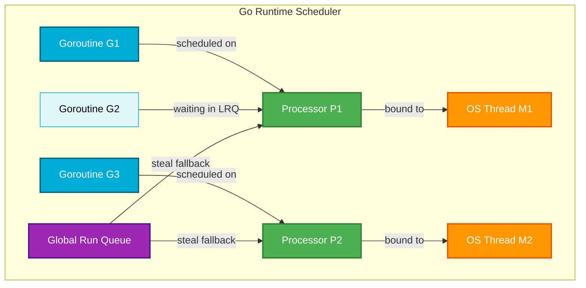
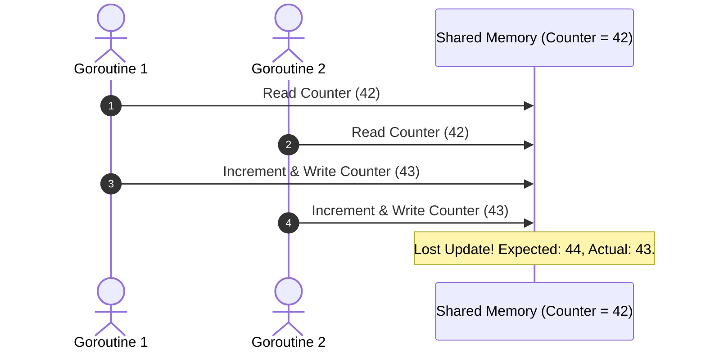
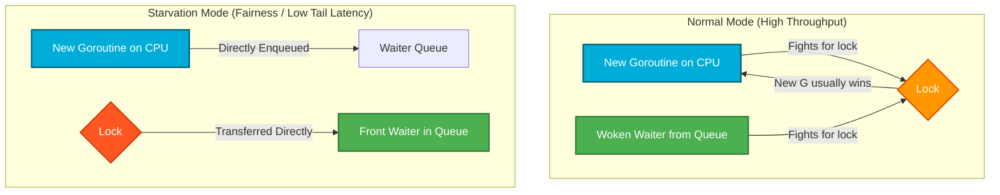
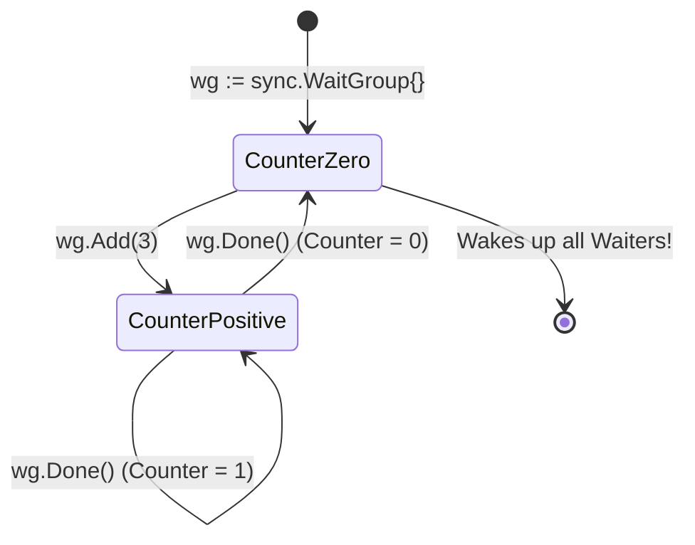
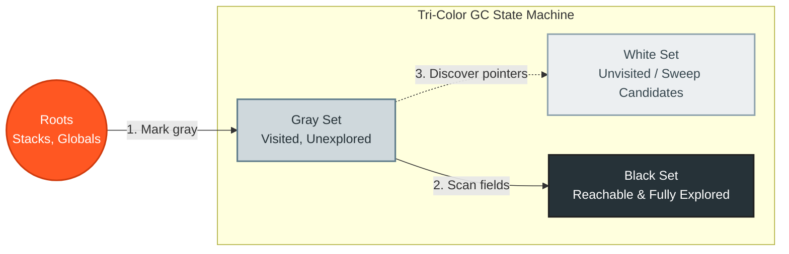
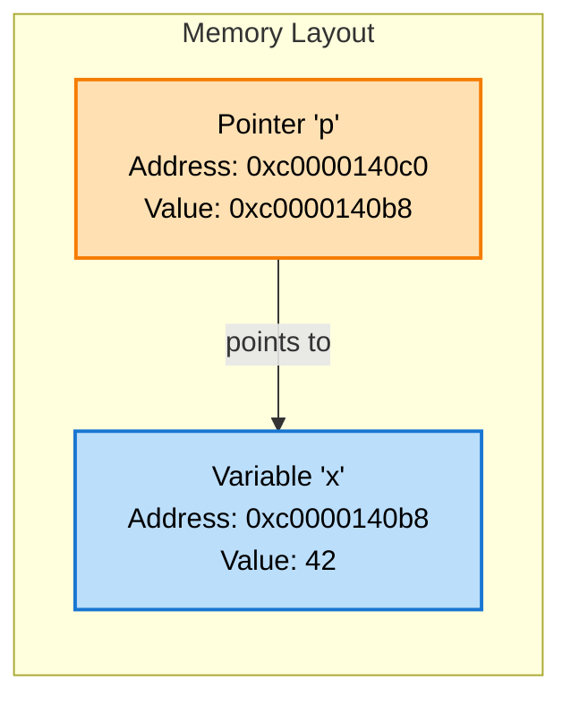
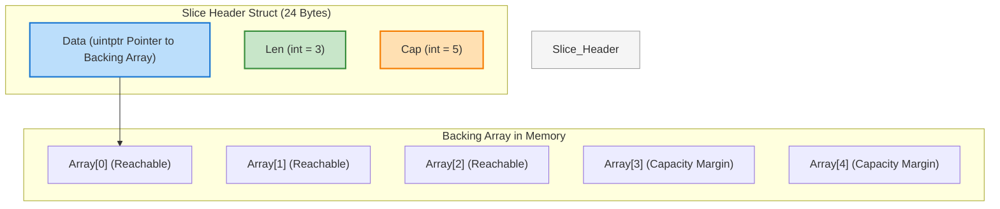
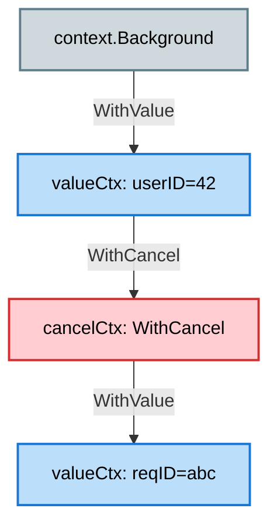

# 🚀 The Ultimate Go (Golang) Interview Cheat Sheet

[](https://go.dev/)
[](https://github.com/Protocol-Lattice/golang-interview-prep-in-english)
[](https://github.com/Protocol-Lattice/golang-interview-prep-in-english)

Welcome to the **Ultimate Go Interview Preparation Guide & Cheat Sheet**. This reference has been meticulously designed and engineered to serve as a high-density, easily skimmable, and visually rich reference during live technical screens, system design rounds, or rapid pre-interview revision. 

It preserves deep technical accuracy while presenting complex topics in a "scan-and-speak" layout.

---

## 💡 Live Technical Interview Tactics

> [!IMPORTANT]
> When hit with a tough Go question, follow this three-step blueprint:
> 1. **Deliver the 5-Second Answer:** State the core mechanism instantly using exact technical keywords (e.g., *"A Go channel is a pointer to an `hchan` struct protected by a mutex..."*). This proves immediate confidence.
> 2. **Draw the Architecture:** Reference scheduler entities ($G, M, P$), memory layouts, or tri-color stages.
> 3. **Reveal the Runtime "Why":** Explain the design trade-off (e.g., *"Go chose an M:N user-space scheduler to avoid expensive OS kernel context-switches..."*).

---

## 📋 Table of Contents

- [⚡ One: Core Concurrency & Runtime (The Engine)](#-one-core-concurrency--runtime-the-engine)
- [🧹 Two: Memory Management & GC Internals](#-two-memory-management--gc-internals)
- [🧩 Three: Go Language Deep-Dives](#-three-go-language-deep-dives)
- [🌐 Four: Networking & APIs (HTTP vs gRPC)](#-four-networking--apis-http-vs-grpc)
- [🏗️ Five: System Design & Infrastructure](#-five-system-design--infrastructure)
- [🔥 Six: The Master Cheat Sheets](#-six-the-master-cheat-sheets)
- [💻 Seven: Production-Ready Code Exercises](#-seven-production-ready-code-exercises)
- [📚 Eight: High-Quality Curated Resources](#-eight-high-quality-curated-resources)

---

## ⚡ One: Core Concurrency & Runtime (The Engine)

### 🚀 Runtime Concurrency Speed Sheet (Read in 10s)
* **Concurrency vs. Parallelism:** Concurrency is about **structure** (handling multiple tasks at once). Parallelism is about **execution** (simultaneous work on multiple CPU cores).
* **M:N Scheduler:** Maps $M$ Goroutines ($G$) onto $N$ OS Threads ($M$) using $P$ Logical Contexts.
* **Work Stealing:** Idle $P$ steals **half** of another $P$'s Local Run Queue (LRQ), checks the Global Run Queue (GRQ) every 61 ticks, or checks network pollers.
* **Syscall Handoff:** Network I/O detaches $G$ to the **Network Poller** (non-blocking). Blocking syscalls detach the OS Thread ($M$) from its Processor ($P$), allowing $P$ to run other $G$'s on a different $M$.
* **Preemption:** Asynchronous since Go 1.14 using Unix OS signals (`SIGURG`) sent every 10ms to interrupt tight, function-less loops.
* **Goroutine vs Thread:** Goroutine starts with a **2 KB** dynamic stack (vs. 1-8 MB fixed thread stack), executes in user-space, and has a sub-100ns context-switch time.
* **Channels:** Managed by the `hchan` struct. Contains a circular queue buffer, a lock, and waiting sender/receiver linked lists.

---

### The Go M:N Scheduler Architecture

Go uses an **M:N user-space scheduler** to multiplex Goroutines across physical kernel threads without OS overhead.



#### The Core Entities (G, M, P)
* **G (Goroutine):** User-space green thread. Holds execution stack (starts at **2 KB**, grows dynamically up to 1 GB), program counter, and scheduling metadata.
* **M (OS Thread / Machine):** A real OS thread managed by the host OS kernel scheduler.
* **P (Processor / Logical Context):** Represents resources required to execute Go code. The number of Ps is governed by `$GOMAXPROCS` (defaults to CPU cores). Each P maintains a **Local Run Queue (LRQ)** of up to 256 runnable Goroutines.

#### Scheduling Algorithms & Core Mechanics
1. **Work Stealing:** When a P finishes its LRQ:
   * It checks the **Global Run Queue (GRQ)** (polled 1 out of every 61 scheduler ticks to prevent starvation).
   * It attempts to steal **half** of another P's local run queue.
   * If still empty, it checks network pollers.
2. **Syscall Handoff (Network Poller vs. Syscall):**
   * **Blocking Syscall:** When G blocks on a file I/O syscall, the scheduler detaches the running OS thread (M) from its P. The P continues executing other Gs by acquiring or creating a new OS thread (M).
   * **Network I/O:** Handled out-of-band by the Network Poller (using OS abstractions like `epoll` or `kqueue`). The G registers its interest, detaches from P, and goes to sleep, freeing the P and M to run other Gs immediately.
3. **Preemption:**
   * **Cooperative (Pre-Go 1.14):** Goroutines could only be preempted at function call boundaries where compiler-injected stack checks (`morestack`) occurred. A tight loop `for {}` without function calls could freeze a thread.
   * **Asynchronous (Go 1.14+):** Uses OS signals (`SIGURG` on Unix systems) to interrupt and preempt running goroutines every 10ms, preventing long-running goroutines from hogging CPUs.

---

### Goroutines vs. OS Threads

| Feature | Goroutine (Go Green Thread) | OS Thread (Kernel Thread) |
| :--- | :--- | :--- |
| **Memory Footprint** | Dynamic stack starts at **2 KB** (grows/shrinks up to 1GB). | Fixed stack size set by OS (typically **1 MB to 8 MB**). |
| **Creation Cost** | Extremely low (~nanoseconds). Allocated purely in user-space heap. | High (~microseconds). Demands a system call to the OS kernel. |
| **Context Switch Cost**| Very fast (~10ns - 100ns). Saves ~14 registers. | Slow (~1µs - 2µs). Causes CPU cache line misses, TLB flushes. |
| **Scheduling Model** | User-space M:N scheduler (cooperative & async signal). | Kernel-space 1:1 scheduler (preemptive). |

---

### Channels & the `hchan` Struct

A **channel** is a typed conduit in Go that enables concurrent goroutines to communicate by sending and receiving values, while automatically synchronizing their execution. Channels are the concrete implementation of **Communicating Sequential Processes (CSP)**, aligning with Go's core concurrency philosophy:

> **"Do not communicate by sharing memory; instead, share memory by communicating."**

#### Core Characteristics
* **Type Safety:** Channels are strongly typed (e.g., `chan int`, `chan string`). A channel can only transmit values of its declared element type.
* **Synchronization:** Beyond data transmission, channels act as synchronization barriers, allowing goroutines to coordinate their execution states without explicit mutexes or condition variables.
* **Reference Type:** Channels are reference types. When you call `make(chan T)`, you allocate memory on the heap and receive a pointer to the underlying runtime structure.

---

#### Under the Hood: The `hchan` Struct

Under the hood, a Go channel is not a magical pipe; it is a pointer to an `hchan` struct (defined in `runtime/chan.go`):

```go
type hchan struct {
    qcount   uint           // Total data in the circular queue
    dataqsiz uint           // Capacity of the circular queue (buffer size)
    buf      unsafe.Pointer // Pointer to an underlying circular array
    elemsize uint16
    closed   uint32         // 1 if closed, 0 otherwise
    elemtype *_type         // Element type
    sendx    uint           // Send index in the circular buffer
    recvx    uint           // Receive index in the circular buffer
    recvq    waitq          // Linked list of blocked receivers (waitq of sudog)
    sendq    waitq          // Linked list of blocked senders (waitq of sudog)
    lock     mutex          // Protects all fields in hchan
}
```

#### Channel State & Operations Matrix

> [!WARNING]
> This table is the single most tested aspect of Go concurrency in coding screens!

| Channel State | Send (`ch <- x`) | Receive (`<-ch`) | Close (`close(ch)`) |
| :--- | :--- | :--- | :--- |
| **Nil** (`var ch chan T`) | **Blocks forever** | **Blocks forever** | **Panics** (`panic: close of nil channel`) |
| **Open & Empty** | Succeeds (blocks if unbuffered) | **Blocks** | Succeeds (receivers get zero-value, `ok == false`) |
| **Open & Full** | **Blocks** | Succeeds | Succeeds (receivers get zero-value, `ok == false`) |
| **Closed** | **Panics** (`panic: send on closed channel`) | Succeeds immediately (returns zero-value, `ok == false`) | **Panics** (`panic: close of closed channel`) |

---

### Buffered vs. Unbuffered Channels: Internal Mechanics & Trade-offs

The core behavior of a Go channel is governed by whether it is **unbuffered** (capacity = 0) or **buffered** (capacity > 0).


#### 1. Unbuffered Channels (Synchronous Synchronization)
* **Mechanics:** An unbuffered channel has **no internal storage buffer** (`dataqsiz == 0`, `buf == nil`).
* **Handoff (Strict Synchronization):** Every send operation must block until a receiver is ready to read, and vice-versa. They act as a synchronization barrier.
* **⚡ Legendary Runtime Optimization: Direct Stack-to-Stack Copy:**
  If Goroutine $G_2$ (the receiver) is already blocked waiting for data in the `recvq` list:
  1. The runtime bypasses the channel's `buf` ring buffer entirely.
  2. The sender ($G_1$) writes the value **directly** into the memory address of the receiver's stack variable.
  3. This is done via `runtime.memmove` under the protection of the channel lock.
  4. **Why this rules:** This eliminates a memory copy (normally copying from sender stack $\rightarrow$ channel buffer $\rightarrow$ receiver stack) and bypasses acquiring the channel lock twice, dramatically improving throughput!

#### 2. Buffered Channels (Asynchronous Queueing)
* **Mechanics:** A buffered channel has an internal ring buffer (`dataqsiz > 0`, `buf` points to a block of memory).
* **Decoupled Workflows:** The sender and receiver do not need to meet. The sender can send values until the buffer is full (`qcount == dataqsiz`), and only then does it block. The receiver can read values until the buffer is empty (`qcount == 0`), and only then does it block.
* **Under-the-Hood Operations:**
  * **Sending (`ch <- x`):**
    1. Lock the `hchan` struct.
    2. Check if a receiver is waiting in `recvq`. If yes, do a direct stack copy and unlock.
    3. If buffer is not full, copy `x` into `buf[sendx]`, increment `sendx` (wrap around if it reaches the end of the array), increment `qcount`, and unlock.
    4. If buffer is full, package the current Goroutine into a `sudog` struct, enqueue it in the `sendq` list, call `gopark()` to put the goroutine to sleep, and unlock.
  * **Receiving (`<-ch`):**
    1. Lock the `hchan` struct.
    2. Check if a sender is waiting in `sendq`.
       - If it's an unbuffered channel: Copy directly from sender's stack to receiver's stack, wake up the sender, unlock.
       - If it's a buffered channel (buffer is full): Read from `buf[recvx]`, copy the blocked sender's value into the end of `buf`, advance indices, wake up the sender, unlock.
    3. If buffer has elements, copy from `buf[recvx]`, increment `recvx`, decrement `qcount`, and unlock.
    4. If buffer is empty, package the current Goroutine into a `sudog` struct, enqueue it in the `recvq` list, call `gopark()` to sleep, and unlock.

---

### 🚨 Race Conditions (Data Races)

A **race condition** (specifically, a *data race* in Go) occurs when two or more goroutines concurrently access the same memory location, at least one of these accesses is a write, and there is no synchronization (e.g., mutexes, atomic operations, channels) to order the accesses.



#### ❌ The Buggy Code (Concurrent Write Conflict)

Here is a classic interview question displaying a severe data race. Run it with multiple workers, and the final count will be less than the target because updates are silently lost!

```go
package main

import (
	"fmt"
	"sync"
)

func main() {
	var count = 0
	var wg sync.WaitGroup

	for i := 0; i < 1000; i++ {
		wg.Add(1)
		go func() {
			defer wg.Done()
			count++ // ❌ DATA RACE! Read-modify-write is not atomic
		}()
	}

	wg.Wait()
	fmt.Printf("Final count: %d (Expected: 1000)\n", count)
}
```

#### 🔍 How to Detect Races in Go: The Race Detector
Go provides a built-in ThreadSanitizer-backed race detector. 
* **Command:** `go test -race ./...` or `go run -race main.go`
* **Under the Hood:** The compiler injects instrumentation at every read and write operation. It records the logical thread clock of accesses. If it detects overlapping unsynchronized access boundaries, it prints a detailed stack trace showing both memory operations.
* **Performance Cost:** Enabling `-race` increases CPU overhead by **2x to 20x** and memory usage by **5x to 10x**. Do not use it in performance-critical production builds, but always use it in local testing and CI/CD pipelines!

---

### 🔒 Mutexes: Mutual Exclusion & sync.Mutex

To prevent data races, Go offers `sync.Mutex` (Mutual Exclusion). It ensures that only one Goroutine can enter a critical section at any given time.

#### 1. Internal Structure of `sync.Mutex`
Under the hood (in `sync/mutex.go`), a Mutex is an extremely lightweight struct occupying just **8 bytes**:

```go
type Mutex struct {
    state int32  // 32-bit state containing lock flags & waiter count
    sema  uint32 // Semaphore for sleeping/waking blocked waiters
}
```

The 32-bit `state` integer is bit-packed to avoid alignment overhead:
* **Bit 0 (`mutexLocked`):** 1 if locked, 0 if free.
* **Bit 1 (`mutexWoken`):** 1 if a sleeping waiter has been woken and is trying to acquire the lock.
* **Bit 2 (`mutexStarving`):** 1 if the Mutex is operating in **Starvation Mode**.
* **Bits 3-31 (`waitersCount`):** Count of goroutines currently queued up and blocked on the semaphore.

```
+--------------------------------------+----+----+----+
|             waitersCount             | star|woke|lock|
|               (29 bits)              | (1) | (1) | (1)|
+--------------------------------------+----+----+----+
 31                                   3    2    1    0  (Bit indices)
```

#### 2. The Lock Path: Fast Path vs. Slow Path
* **Fast Path (CAS Lock):** 
  If the mutex is completely free (state is 0), the calling goroutine attempts to flip the `mutexLocked` bit to 1 using a single atomic Compare-And-Swap (`atomic.CompareAndSwapInt32`). If it succeeds, it returns immediately. This executes in a **single CPU instruction** (< 1ns).
* **Slow Path (Spinning & Enqueueing):**
  If CAS fails (already locked), the goroutine enters the slow path:
  1. **Active Spinning:** If the goroutine is on a multi-core machine and the scheduler predicts the current owner will release the lock soon, it spins (executes a tight loop of `PAUSE` instructions) up to a limit, attempting to acquire the lock when released without leaving the CPU.
  2. **Parking (Blocking):** If spinning is not allowed or fails, the goroutine increments `waitersCount`, registers itself on the lock's `sema` queue, and calls the runtime function `gopark()` to put itself to sleep, yielding its OS thread.

#### 3. Normal Mode vs. Starvation Mode
Go's Mutex is highly optimized to balance average throughput and worst-case latency.

| Attribute | Normal Mode | Starvation Mode |
| :--- | :--- | :--- |
| **Priority** | Favors high overall **throughput**. Spawns CPU-level competition. | Protects tail-latency. Favors **fairness**. |
| **New Goroutines** | Newly active CPU goroutines can steal the lock from queued waiters. | Blocked from stealing the lock. Must enqueue at the tail. |
| **Hand-Off** | Woken waiter competes with incoming goroutines. Often loses. | Lock ownership is transferred **directly** to the first waiter. |
| **Trigger** | Default mode of operation. | A waiter has failed to acquire the lock for $>1\text{ms}$. |



#### 4. Safe Code Example: Resolving the Data Race

Using `sync.Mutex` to protect the critical read-modify-write block ensures data safety:

```go
package main

import (
	"fmt"
	"sync"
)

type SafeCounter struct {
	mu    sync.Mutex
	count int
}

func (c *SafeCounter) Increment() {
	c.mu.Lock()
	defer c.mu.Unlock() // Always unlock inside a defer to prevent deadlocks on panics
	c.count++
}

func (c *SafeCounter) Value() int {
	c.mu.Lock()
	defer c.mu.Unlock()
	return c.count
}

func main() {
	counter := &SafeCounter{}
	var wg sync.WaitGroup

	for i := 0; i < 1000; i++ {
		wg.Add(1)
		go func() {
			defer wg.Done()
			counter.Increment()
		}()
	}

	wg.Wait()
	fmt.Printf("Final count: %d\n", counter.Value()) // Guaranteed: 1000
}
```

> [!WARNING]
> **Pro-Level Gotcha: Copying Mutexes is Catastrophic!**
> A Mutex contains an internal state. If you pass a struct containing a Mutex by value (copying it), you copy the Mutex's state. If a locked Mutex is copied, the copy is also locked, leading to instant deadlocks.
> * **Standard Practice:** Always pass structs containing Mutexes **by pointer** or make the receiver a pointer (e.g. `func (c *SafeCounter) ...`).

---

### 👥 Coordinating Workers with sync.WaitGroup

`sync.WaitGroup` is a synchronization primitive used to block execution until a collection of concurrent goroutines have finished running.

#### 1. Internal Structure of `sync.WaitGroup`
A WaitGroup is defined as:

```go
type WaitGroup struct {
    noCopy noCopy // Prevents copying by static checkers (go vet)
    state  align64State // Bit-packed state representing wait count, waiter count, and sema
}
```

* **Wait Counter (32 bits):** The number of active goroutines registered with `Add()`.
* **Waiter Count (32 bits):** The number of goroutines blocked on `Wait()`.
* **Semaphore (32 bits):** Used to wake up the goroutines blocked on `Wait()` when the wait counter drops to zero.

#### 2. Operations & Lifecycle
1. **`wg.Add(delta int)`:** Adds the delta (can be positive or negative) to the wait counter. If the wait counter becomes 0, all blocked goroutines waiting on `Wait()` are woken up via the internal semaphore. If the counter goes negative, the runtime triggers a panic.
2. **`wg.Done()`:** Syntactic sugar for `wg.Add(-1)`.
3. **`wg.Wait()`:** Blocks the calling goroutine. It checks if the wait counter is 0; if yes, it returns immediately. Otherwise, it increments the waiter count and sleeps on the semaphore.



#### 3. Production-Ready Code Example

```go
package main

import (
	"fmt"
	"net/http"
	"sync"
	"time"
)

func fetchStatus(url string, wg *sync.WaitGroup) {
	defer wg.Done() // Guaranteed to decrease counter on return

	client := http.Client{Timeout: 2 * time.Second}
	resp, err := client.Get(url)
	if err != nil {
		fmt.Printf("❌ %s is down: %v\n", url, err)
		return
	}
	defer resp.Body.Close()
	fmt.Printf("✅ %s returned HTTP %d\n", url, resp.StatusCode)
}

func main() {
	urls := []string{
		"https://golang.org",
		"https://go.dev",
		"https://github.com",
	}

	var wg sync.WaitGroup

	for _, url := range urls {
		wg.Add(1) // Increment counter BEFORE spawning
		go fetchStatus(url, &wg) // Pass WaitGroup as a pointer!
	}

	fmt.Println("Waiting for all lookups to complete...")
	wg.Wait() // Blocks until counter returns to 0
	fmt.Println("All lookups finished!")
}
```

#### 4. The 4 Ultimate WaitGroup Pitfalls (High-Yield Interview Content)

> [!CAUTION]
> Junior developers break these constantly. Senior candidates are expected to spot them in 2 seconds:

1. **❌ Spawning before Adding:** Calling `wg.Add(1)` inside the spawned goroutine rather than before it.
   * *Why:* The parent goroutine can reach `wg.Wait()` before the spawned goroutines are scheduled and call `Add(1)`. The parent will read a counter of 0, assume work is done, and exit immediately!
   * *Fix:* **Always call `Add()` before executing `go worker()`**.
2. **❌ Copying by Value:** Passing `wg` by value into functions (e.g., `func worker(wg sync.WaitGroup)`).
   * *Why:* It duplicates the internal state. The spawned goroutine calls `Done()` on the copy, which has no effect on the parent's `wg`. The parent blocks forever (deadlock).
   * *Fix:* **Always pass the WaitGroup by pointer (`*sync.WaitGroup`)**.
3. **❌ Negative Counter Panic:** Calling `wg.Done()` more times than `wg.Add(1)` was called.
   * *Why:* Triggers an instant, non-recoverable runtime panic: `panic: sync: negative WaitGroup counter`.
   * *Fix:* Ensure `wg.Done()` matches `wg.Add()` exactly, often using `defer wg.Done()`.
4. **❌ Concurrent Re-use:** Calling `wg.Add()` concurrently while `wg.Wait()` is already blocking.
   * *Why:* Causes a race condition and potential panic or deadlock. A WaitGroup can only be reused once all previous waiters have exited `Wait()`.

---

### 🤓 Advanced Synchronization: RWMutex & sync.Map

* **`sync.RWMutex`:** A reader-writer lock. Multiple readers can hold the read lock (`RLock`), but the write lock (`Lock`) is completely exclusive. To prevent writer starvation, new readers are blocked if a writer is already waiting.
* **`sync.Map`:** Specialized concurrent map optimized for two cases:
  1. Read-heavy workloads where keys don't change frequently.
  2. Disjoint concurrent writes (different keys written by different goroutines).
  * *How it works:* Uses two maps: a lockless `read` map (updated atomically) and a locked `dirty` map. Lookups check `read` first. If it misses repeatedly (above a threshold), the `dirty` map is promoted to the `read` map under a lock.

---

## 🧹 Two: Memory Management & GC Internals

### 🚀 Garbage Collection & Memory Speed Sheet (Read in 10s)
* **Tri-Color GC:** Concurrent, low-latency mark-and-sweep. Divides pointers into **White** (unreachable candidates), **Gray** (visited, children unscanned), and **Black** (visited and fully scanned).
* **Write Barrier:** Intercepts runtime pointers to enforce the GC invariant: ensures a running application doesn't hide a white object behind a black one.
* **Stack vs. Heap:** Stack is LIFO, managed by threads, zero-GC overhead. Heap is globally shared, TCMalloc-designed, managed by the GC.
* **Escape Analysis:** Compile-time analysis to decide if memory goes to the stack or escapes to the heap.
* **Heap Escape Triggers:** Returning local pointers, interface values (dynamic dispatch like `fmt.Println`), dynamic/large size slice allocations, and sending pointers over channels.

---

### The Tri-Color Mark & Sweep GC

Go uses a concurrent, tri-color mark-and-sweep garbage collector designed for low latency.



1. **White Set (Unvisited):** Candidates for deletion. At the start of a GC cycle, all objects are White.
2. **Gray Set (Visited, Unexplored):** Reachable from roots, but their children have not been scanned yet.
3. **Black Set (Visited & Explored):** Reachable, and all child pointers have been fully scanned. Black objects contain no pointers directly to White objects.

#### The GC Process:
* **Phase 1: Sweep Termination (STW - Stop The World):** Prepares for marking, activates write barriers.
* **Phase 2: Concurrent Mark:** Scans root pointers (stacks, globals) and pushes them onto the gray queue. Goroutines traverse gray objects, mark children gray, and mark parents black.
* **Phase 3: Mark Termination (STW):** Flushes local cache buffers, completes the marking phase.
* **Phase 4: Concurrent Sweep:** Reclaims memory occupied by remaining White objects and returns it to the allocator.

#### Why do we need the Write Barrier?
Since GC runs concurrently with application threads (mutators), a mutator could hide a white object by assigning it to a black object and breaking the pointer chain from gray objects. The **Write Barrier** intercepts write operations at runtime: if a pointer to a white object is written, it is forced into the gray set, preserving the GC invariants.

---

### Stack vs. Heap & Escape Analysis
* **Stack:** Very fast, local allocation. Follows LIFO structure, managed at thread-level, does not require garbage collection.
* **Heap:** Shared memory pool. Slower allocation, managed via a TCMalloc-inspired allocator (`mcache` -> `mcentral` -> `mheap`), reclaimed by the Garbage Collector.

#### Escape Analysis Rules
The Go compiler uses Escape Analysis at compile-time to decide if a variable can reside on the stack or must escape to the heap.

> [!IMPORTANT]
> **Common Causes of Heap Escape:**
> 1. **Returning a Pointer:** A pointer to a local variable is returned from a function. The variable's lifetime exceeds the function's stack frame.
> 2. **Interface Dynamic Dispatch:** Storing a concrete type in an interface (e.g., calling `fmt.Println(x)` or `json.Marshal(x)`).
> 3. **Dynamic / Large Allocations:** Creating a slice with a size only known at runtime (e.g., `make([]byte, size)`) or exceeding the compiler's size threshold (~64KB).
> 4. **Channel Transmission:** Sending a pointer to a channel (the compiler cannot guarantee which goroutine receives it or when).

#### How to Analyze Escape Decisions:
```bash
go build -gcflags="-m -l" main.go
```
*Note: The `-l` flag disables function inlining, making escape analysis decisions easier to trace.*

---

## 🧩 Three: Go Language Deep-Dives

### 🚀 Language Semantics Speed Sheet (Read in 10s)
* **Pointers:** Holds a memory address pointing to a value. Go is strictly pass-by-value; passing a pointer copies the memory address (8 bytes), still referencing the original data. No pointer arithmetic is allowed for safety.
* **Slices:** 24-byte header referencing a backing array. Contains `Data` pointer, `Len`, and `Cap`.
* **Slice Growth:** Doubles if $< 256$ elements. For larger sizes, grows by a scaling factor transitioning smoothly toward $1.25\times$.
* **Maps:** Pointer to an `hmap` struct holding a collection of 8-item buckets (`bmap`). Concurrent read/write throws a non-recoverable runtime panic.
* **Interface Nil Trap:** Interfaces hold `type` and `data` fields. An interface is only `nil` if **both** fields are `nil`.
* **Defer:** Executed LIFO at function exit. Arguments are evaluated **immediately** when the `defer` line is encountered, not when executing.

---

### Pointers & Memory Address Mechanics

A **pointer** is a variable that stores the memory address of another value, rather than the value itself.



#### Core Operators
* **`&` (Address-of):** Generates a pointer to a variable. E.g., `p := &x` stores the address of `x` in `p`.
* **`*` (Dereference):** Accesses or modifies the value at the address stored in a pointer. E.g., `*p = 100` modifies the original variable `x`.

```go
package main

import "fmt"

func main() {
	x := 42
	p := &x // Type of p is *int (pointer to int)

	fmt.Printf("Value of x: %d\n", x)        // 42
	fmt.Printf("Memory address of x: %p\n", p) // e.g. 0xc0000140b8
	fmt.Printf("Value via pointer: %d\n", *p)   // 42

	*p = 100 // Dereferencing to modify x
	fmt.Printf("New value of x: %d\n", x)     // 100
}
```

#### The 5 Pillars of Go Pointers (High-Yield Interview Focus)

1. **Strict Pass-by-Value Semantics:**
   Go is strictly pass-by-value. When a pointer is passed to a function, Go copies the **pointer value** (the 8-byte memory address). The caller and callee have different pointer variables, but because they hold the same memory address, mutating the dereferenced value inside the function alters the original caller's data.
   
2. **Zero Pointer Arithmetic (Safety):**
   Unlike C/C++, Go does not allow pointer arithmetic (e.g., `p++` to jump to the next memory address is a compile-time error). This prevents buffer overflows, segment faults, and arbitrary memory corruption. For low-level runtime implementation, Go provides `unsafe.Pointer` and `uintptr`, but these bypass compile-time safety and garbage collection tracking.

3. **The `nil` Pointer Trap:**
   The zero-value of a pointer is `nil`. Attempting to dereference a `nil` pointer (e.g., `var p *int; *p = 1`) triggers an immediate, unrecoverable runtime panic: `panic: runtime error: invalid memory address or nil pointer dereference`.

4. **Escape Analysis Decisions:**
   Declaring a pointer or taking a variable's address often triggers **Escape Analysis** to move the allocation from the stack to the heap. For example, returning a pointer to a local variable from a function causes that variable to escape because its lifetime exceeds the function's stack frame.

5. **Value vs. Pointer Receivers:**
   * **Pointer Receiver (`(t *T)`):** Must be used if the method mutates the receiver's state, or to avoid copying large structs (since copying a pointer is only 8 bytes, whereas copying a large struct degrades performance).
   * **Value Receiver (`(t T)`):** The method operates on a copy of the receiver. Safe for read-only concurrency, but modifications do not propagate back to the caller.

---

### Slices Under the Hood

A slice is not an array; it is a **descriptor header** containing metadata that references a backing array. It is defined in `reflect.SliceHeader`:



```go
type SliceHeader struct {
    Data uintptr // Pointer to the underlying array element
    Len  int     // Length: number of elements in the slice
    Cap  int     // Capacity: maximum elements the backing array can hold
}
```

* **Pass-By-Value:** Go passes everything by value. Passing a slice into a function copies the 24-byte `SliceHeader`. Modifying elements inside the function alters the shared backing array, but appending to the slice within the function may reallocate a new backing array, leaving the caller's slice header unchanged.

#### Slice Capacity Growth (Go 1.18+):
1. If the new capacity is greater than double the old capacity, the new capacity is set to the requested capacity.
2. Otherwise, if the old capacity is less than 256, it doubles.
3. For larger capacities, it transitions to a scale factor:
   $$\text{newcap} = \text{oldcap} + \frac{\text{oldcap} + 3 \times 256}{4}$$
   *This ensures a smooth transition from $2\times$ growth to $1.25\times$ growth.*

---

### Maps Under the Hood
A Go map is a pointer to an `hmap` struct. Maps are implemented as a collection of buckets:
* **Structure:** Each bucket (`bmap` struct) holds up to 8 key-value pairs.
* **Accessing a Key:** Go hashes the key. The low-order bits determine which bucket contains the key, and the high-order bits (`tophash`) identify the specific key within the bucket.
* **Why maps are NOT thread-safe:** Maps are optimized for speed. Reading/writing maps concurrently sets a `flags` bit in `hmap`. If the runtime detects a write while another operation is in progress, it triggers a non-recoverable runtime crash: `fatal error: concurrent map writes`.
* **How to make them safe:** Wrap the map in a struct with a `sync.RWMutex`, or use `sync.Map`.

---

### The Interface Nil Trap
This is one of the most common senior-level Go trick questions.

```go
var p *int = nil
var i any = p

fmt.Println(i == nil) // Outputs: FALSE!
```

#### Why?
An interface variable contains two fields internally:
1. `type` (dynamic type information, e.g., `*int`).
2. `data` (pointer to the concrete value, e.g., `nil`).

An interface value is only considered `nil` if **both** the `type` and `data` fields are `nil`. In the example above, `i` has a valid type pointer (`*int`), so `i == nil` evaluates to `false`.

---

### 📏 Struct Alignment & Memory Padding (The Silent Memory Waster)

CPUs do not read memory one byte at a time; instead, they read in **word sizes** (typically 8 bytes on a 64-bit architecture). To optimize CPU memory access, compilers use memory alignment, inserting "padding bytes" to ensure fields align to boundaries of their type's size.

#### Struct Size Paradox: Why Order Matters!

Consider the following two structs containing identical fields, but arranged in different orders:

```go
type BadStruct struct {
	A bool  // 1 byte
	B int64 // 8 bytes
	C bool  // 1 byte
} // Size: 24 bytes! (83% wasted space)

type GoodStruct struct {
	B int64 // 8 bytes
	A bool  // 1 byte
	C bool  // 1 byte
} // Size: 16 bytes! (25% wasted space)
```

#### Visualizing the Memory Layout

##### ❌ `BadStruct` (24 Bytes)
| Byte Offset | 0 | 1 | 2 | 3 | 4 | 5 | 6 | 7 |
| :--- | :---: | :---: | :---: | :---: | :---: | :---: | :---: | :---: |
| **Row 1 (0-7)** | `A` (bool) | 🚫 *Pad* | 🚫 *Pad* | 🚫 *Pad* | 🚫 *Pad* | 🚫 *Pad* | 🚫 *Pad* | 🚫 *Pad* |
| **Row 2 (8-15)** | `B` (int64) | `B` (int64) | `B` (int64) | `B` (int64) | `B` (int64) | `B` (int64) | `B` (int64) | `B` (int64) |
| **Row 3 (16-23)** | `C` (bool) | 🚫 *Pad* | 🚫 *Pad* | 🚫 *Pad* | 🚫 *Pad* | 🚫 *Pad* | 🚫 *Pad* | 🚫 *Pad* |

*Reason:* An 8-byte field must start on an offset that is a multiple of 8. Therefore, 7 bytes of padding are added after `A`. Another 7 bytes of padding are added at the end of `C` to ensure the next struct in an array aligns correctly.

##### ✅ `GoodStruct` (16 Bytes)
| Byte Offset | 0 | 1 | 2 | 3 | 4 | 5 | 6 | 7 |
| :--- | :---: | :---: | :---: | :---: | :---: | :---: | :---: | :---: |
| **Row 1 (0-7)** | `B` (int64) | `B` (int64) | `B` (int64) | `B` (int64) | `B` (int64) | `B` (int64) | `B` (int64) | `B` (int64) |
| **Row 2 (8-15)** | `A` (bool) | `C` (bool) | 🚫 *Pad* | 🚫 *Pad* | 🚫 *Pad* | 🚫 *Pad* | 🚫 *Pad* | 🚫 *Pad* |

*Reason:* Grouping the smaller `bool` fields together allows them to fit within the same 8-byte word, saving an entire 8-byte block!

> [!TIP]
> **Interview Pro-Tip:** To instantly optimize memory usage of a struct, always **order fields from largest to smallest**.

---

### 🧩 Struct Embedding: Composition, Not Inheritance

Go intentionally does not support class inheritance. Instead, it embraces the principle of **Composition over Inheritance** using **Struct Embedding**.

#### What is Struct Embedding?
When you define a struct field without an explicit field name, it is an **embedded (or anonymous) field**. The outer struct automatically gains access to all the fields and methods of the embedded struct. This mechanism is known as **field and method promotion**.

```go
type Engine struct {
	HP int
}

func (e *Engine) Start() {
	fmt.Println("Engine starting...")
}

type Car struct {
	Engine // Embedded field (no name, only type)
	Brand  string
}
```

#### Key Rules of Embedding in Go

1. **Composition, Not Subtyping:** A `Car` **contains** an `Engine`, but a `Car` is **not** an `Engine`. You cannot pass a `Car` value to a function expecting an `Engine`. There is no polymorphism via struct hierarchy in Go.
2. **Method & Field Promotion:** Since `Engine` is embedded, we can call `car.Start()` and access `car.HP` directly, instead of writing `car.Engine.Start()` or `car.Engine.HP`.
3. **Explicit Access (No Shadowing Lockout):** If the outer struct defines a field or method with the same name as an embedded one, it "shadows" (overrides) the embedded one. However, the embedded one is not lost; it remains accessible via its explicit type name:
   ```go
   type Car struct {
       Engine
       HP int // Shadows Engine.HP
   }
   
   myCar := Car{}
   myCar.HP = 200        // Outer HP
   myCar.Engine.HP = 150 // Inner HP (still fully accessible)
   ```
4. **Interface Satisfaction:** If the embedded struct implements an interface, the outer struct automatically implements that interface too via method promotion.

> [!IMPORTANT]
> **Why Go Rejects Inheritance:**
> Inheritance creates tight coupling between parent and child classes (the fragile base class problem). Struct embedding maintains complete independence between the components while providing the syntactic convenience of field/method delegation.

---

### 🔗 Context Tree Architecture & Internals

`context.Context` is the standardized mechanism in Go for carrying deadlines, cancellation signals, and request-scoped values across API boundaries.

#### The Context Interface
Under the hood, a Context is defined by a simple interface containing four methods:
```go
type Context interface {
    Deadline() (deadline time.Time, ok bool)
    Done() <-chan struct{}
    Err() error
    Value(key any) any
}
```

#### Under-the-Hood Concrete Structs
1. **`emptyCtx`:** An empty, non-cancelable context with no values (returned by `context.Background()` or `context.TODO()`). It is internally represented as a simple custom integer (`type emptyCtx int`).
2. **`cancelCtx`:** Formed using `WithCancel` or `WithDeadline`. It contains a mutex, a channel closed on cancellation, and a map of children:
   ```go
   type cancelCtx struct {
       Context
       mu       sync.Mutex
       done     atomic.Value          // of chan struct{}
       children map[canceler]struct{} // tracks child cancelCtxs to propagate cancel
       err      error                 // returns non-nil after cancellation
   }
   ```
3. **`valueCtx`:** Formed using `WithValue`. It bundles a single key-value pair and embeds a parent context.



> [!WARNING]
> **The $O(N)$ Context Value Trap:**
> Lookups using `.Value(key)` traverse the context chain upwards recursively. Searching for a key requires **$O(N)$ linear time complexity**, where $N$ is the depth of the context tree.
> * **Rules of Thumb:** Never use context values for optional function parameters, configuration objects, or high-throughput transaction stores. Use them exclusively for request-scoped metadata (e.g., Auth tokens, Request IDs, or trace IDs).

---

### 🛠️ Generics & GC-Shape Stenciling

Introduced in Go 1.18, generics enable compile-time type safety without sacrificing performance. Different languages implement generics differently:
- **C++ (Monomorphization):** Generates dedicated compiled code for every unique type argument combination. Results in fast runtime but massive binary bloat.
- **Java (Type Erasure):** Replaces type parameters with `Object` and inserts dynamic runtime casts. Zero binary bloat but causes heap allocation/boxing overhead.

#### Go's Solution: GC-Shape Stenciling with Dictionaries
Go implements a hybrid approach to maintain fast compilation and small binary sizes while keeping execution swift:

1. **GC-Shape (Gshape) Grouping:** The compiler groups type parameters by their garbage collection properties.
   - All pointer types (e.g., `*User`, `*Item`, `*string`) share the same Gshape because they are represented as 8-byte addresses.
   - Integral types of the same size share Gshapes.
2. **Dictionary Passing:** The compiler generates a single, shared binary function for each Gshape. To handle type-specific behaviors (like invoking methods or comparing values), it implicitly passes a **type dictionary** to the compiled function at runtime containing sizes, hashes, and method pointers.

---

### ⚠️ Modern Error Handling: wrapping, Is, and As

Go does not use exceptions; errors are values. Go 1.13+ added standardized error wrapping, and Go 1.20 extended this to support multi-error wrapping.

#### The Wrapping Protocol
Any error that implements the `Unwrap() error` method is considered a wrapped error. Since Go 1.20, errors can also implement `Unwrap() []error` to support multiple parents (e.g., `errors.Join()`).

* **`errors.Is(err, target)`:** Recursively walks the error wrapper tree using `Unwrap()`. Returns `true` if any error in the chain matches the `target` value. Useful for checking sentinel errors (e.g., `errors.Is(err, sql.ErrNoRows)`).
* **`errors.As(err, target)`:** Recursively walks the error chain. If an error matches the type of `target` (which must be a pointer to an error type), it sets the target variable and returns `true`. Useful for extracting custom error structs:

```go
var pathErr *os.PathError
if errors.As(err, &pathErr) {
    fmt.Println("Failed path:", pathErr.Path)
}
```

---

## 🌐 Four: Networking & APIs (HTTP vs gRPC)

### 🚀 Networking & API Speed Sheet (Read in 10s)
* **Idempotency:** `GET`, `PUT`, `DELETE` are idempotent (repeated calls yield identical server states). `POST`, `PATCH` are non-idempotent.
* **HTTP/2 Benefits:** Fully binary transport, multiplexes multiple streams over one TCP connection, uses HPACK header compression, and supports Server Push.
* **gRPC core:** Operates over HTTP/2, uses binary Protobuf serialization, and facilitates four streaming modes: Unary, Client-Streaming, Server-Streaming, and Bidirectional-Streaming.

---

### HTTP Methods & Idempotency

| Method | Safe | Idempotent | Request Body | Response Body |
| :--- | :---: | :---: | :---: | :---: |
| **GET** | ✅ Yes | ✅ Yes | ❌ No | ✅ Yes |
| **POST** | ❌ No | ❌ No | ✅ Yes | ✅ Yes |
| **PUT** | ❌ No | ✅ Yes | ✅ Yes | ✅ Yes/No |
| **PATCH**| ❌ No | ❌ No | ✅ Yes | ✅ Yes |
| **DELETE**| ❌ No | ✅ Yes | ❌ No | ✅ Yes/No |

* **Safe:** Does not modify resource state on the server.
* **Idempotent:** Making multiple identical requests yields the same server state as a single request.

---

### HTTP/1.1 vs. HTTP/2

| Feature | HTTP/1.1 | HTTP/2 |
| :--- | :--- | :--- |
| **Transport Format** | Plain Text | Binary Framing (Stream/Frame structure) |
| **Multiplexing** | ❌ No (Requires multiple TCP connections) | ✅ Yes (Concurrent streams over a single TCP connection) |
| **Header Compression**| ❌ No (Text headers sent repeatedly) | ✅ Yes (HPACK compression) |
| **Server Push** | ❌ No | ✅ Yes (Server can preemptively push resources) |

---

## 🏗️ Five: System Design & Infrastructure

### 🚀 Architecture Speed Sheet (Read in 10s)
* **Autoscaling:** HPA scales **pod counts** horizontally (via CPU/metrics). VPA scales **pod resources** vertically (CPU/memory limits). Do not run both on the same metric!
* **Rate Limiting:** Token Bucket (allows bursts up to capacity), Leaky Bucket (smooths output to a constant rate), Sliding Window (strict time window accuracy).
* **Resiliency:** Circuit Breakers fail-fast immediately on open states to protect downstream systems. Backoffs use dynamic exponential intervals with random **jitter** to prevent thundering herd spikes.

---

### Autoscaling: HPA vs. VPA
* **Horizontal Pod Autoscaler (HPA):** Scales the **number of pods** in response to metrics like CPU usage, Memory limits, or custom Prometheus metrics (e.g., HTTP request rate).
* **Vertical Pod Autoscaler (VPA):** Adjusts the **CPU and Memory limits** of existing pods. Useful for stateful services.
* *Production Warning:* Do not run HPA and VPA concurrently on the exact same resource metrics (like CPU/Memory) to avoid race conditions.

---

### Rate Limiting Algorithms
1. **Token Bucket:** A bucket is filled with tokens at a constant rate up to a max capacity. Every request consumes a token. Allows handling bursts up to the bucket capacity.
2. **Leaky Bucket:** Requests enter a queue and are processed at a constant, fixed rate. Smoothes out traffic spikes but adds latency to bursts.
3. **Sliding Window Counter:** Divides time into windows and keeps track of requests. Prevents sudden traffic bursts at window boundaries.

---

### Microservice Resiliency
* **Circuit Breaker:** Prevents cascading failures.
  * **Closed:** Normal traffic flows.
  * **Open:** Fails fast immediately without calling the struggling downstream service.
  * **Half-Open:** Periodically sends a small fraction of traffic to test if the downstream service has recovered.
* **Exponential Backoff and Jitter:** When retrying failed requests, double the wait time with each retry (exponential) and add a random variance (jitter) to prevent the "thundering herd" problem from overwhelming downstream databases.

---

## 🔥 Six: The Master Cheat Sheets

This section is engineered to be your primary companion during a live interview. The middle column offers immediate, high-yield answers you can deliver within the first 5 seconds.

### 🐣 Junior & Mid-Level Cheat Sheet

| 🎯 The Trick Question | ⚡ 5-Second Answer (Immediate Impact) | 🔍 Detailed Technical Deep-Dive |
| :--- | :--- | :--- |
| **When should you use a pointer receiver?** | Use them **to modify receiver state** or **to avoid copying massive structs** on method execution. | 1. If the method mutates the struct's internal fields.<br>2. When passing a large struct by value degrades memory and CPU performance due to deep copy allocations.<br>3. When maintaining consistent method sets across interfaces. |
| **What happens if you write to a nil map?** | It triggers an **immediate, unrecoverable runtime panic**. | A nil map pointer does not reference an initialized `hmap` struct. To avoid `panic: assignment to entry in nil map`, you must allocate bucket memory first via `make(map[K]V)`. |
| **How do you avoid goroutine leaks?** | Ensure **every goroutine has a guaranteed exit condition** using contexts or closed channels. | 1. Never launch a goroutine without knowing how and when it terminates.<br>2. Pass a cancelable `context.Context` to abort waiting workers.<br>3. Avoid blocking sends on unbuffered channels where no receiver is active. |
| **Why does Go use `make` vs. `new`?** | `new` allocates **zeroed memory** returning `*T`; `make` **initializes internal headers** for slices, maps, and channels. | - `new(T)` returns a pointer (`*T`) to a zero-filled type `T` (works on all types).<br>- `make(T, args)` is restricted exclusively to slices, maps, and channels; it sets up complex internal runtime headers (like backing arrays, `hmap` bucket pointers, or `hchan` circular buffers). |
| **How does Go 1.22 fix the loop variable bug?** | Loop variables are now **freshly allocated per iteration**, resolving closures capturing the same address. | Prior to 1.22, a loop variable shared a single memory address across all iterations. Goroutines launched inside the loop captured that same pointer, leading to race conditions. Since 1.22, the compiler generates a new scope and allocation per iteration. |
| **How do you safely detect race conditions?** | Execute your test suite or runtime binary with the **`-race` compiler flag**. | Enabling the race detector (`go test -race` or `go run -race`) injects thread instrumentation that tracks memory access boundaries. It raises warnings if two concurrent goroutines access the same memory location, where at least one access is a write, without synchronization. |
| **How does `errors.Is` differ from standard `==` error checks?** | `errors.Is` **traverses the entire wrapped error chain**, whereas `==` only checks direct pointer equality. | - Standard `==` fails if an error has been wrapped using `%w` (e.g. `fmt.Errorf("wrapped: %w", err)`).<br>- `errors.Is` recursively unwraps the error to inspect if the target sentinel error exists anywhere in its tree structure. |

---

### 🦅 Senior & Staff-Level Cheat Sheet

| 🎯 The Trick Question | ⚡ 5-Second Answer (Immediate Impact) | 🔍 Detailed Technical Deep-Dive |
| :--- | :--- | :--- |
| **How do you tune Go's GC?** | Optimize memory cycles using **`GOGC`** for target heap ratios and **`GOMEMLIMIT`** to prevent OOMs. | 1. **`GOGC` (default 100):** Governs target heap growth ratio. A value of 100 means GC runs when live heap size doubles.<br>2. **`GOMEMLIMIT` (Go 1.19+):** Defines a hard memory limit. Prevents OOM kills in containerized environments by triggering aggressive GC sweeps as memory usage approaches the limit. |
| **Explain Mutex Starvation mode.** | It prevents waiter starvation by **transferring the lock directly** to the first queue waiter if wait time exceeds 1ms. | - **Normal Mode:** Waiters queue, but newly spawned active goroutines on the CPU often steal the lock because they are already scheduled.<br>- **Starvation Mode:** Triggered if a waiter has waited $>1\text{ms}$. New CPU arrivals do not spin or attempt to acquire the lock; they enqueue directly. The current owner hands the lock directly to the front-of-queue waiter, mitigating tail-latency spikes. |
| **How do you profile a Go service in production?** | Integrate **`net/http/pprof`** to extract and analyze low-overhead flamegraphs. | Pull interactive, low-overhead performance charts directly using `go tool pprof`. You can collect CPU, memory, thread creation, and blocking profiles with negligible impact on live requests, helping to identify lock contention or excessive allocations. |
| **What is Profile-Guided Optimization (PGO)?** | PGO lets the compiler **optimize code generation** using real performance profiles collected from production. | Introduced in Go 1.20, PGO allows the compiler to optimize code generation (e.g., devirtualizing interface calls, aggressive function inlining) using real performance profiles collected from production, boosting CPU efficiency by 2% to 14%. |
| **What are contiguous stacks in Go?** | Go uses **dynamic contiguous stacks** that automatically double in size and copy values when exhausted. | If a goroutine requires more stack space than its current frame provides, Go allocates a new, double-sized contiguous memory block, copies the old stack, updates all pointers, and frees the old block. |
| **Why are maps not concurrent safe?** | To **maximize raw speed**; Go chooses immediate crashes over silent data corruption on concurrent writes. | To maximize execution speed. Concurrent map writes set a flag; if Go detects simultaneous read/write or write/write operations, it calls `throw()` to trigger an immediate, non-recoverable runtime crash. |
| **Why is `uintptr` unsafe to store pointers?** | Because the **GC does not track `uintptr`**, so the referenced memory can be garbage-collected at any time. | - `unsafe.Pointer` is a real pointer tracked by the garbage collector.<br>- `uintptr` is a plain integer. If a heap-allocated object is only referenced via a `uintptr` (after conversion), the GC treats it as unreachable and may sweep it, leading to dangling pointers/corruption. |
| **Why does context lookup take $O(N)$ time?** | Each `WithValue` call creates a new node in a **singly-linked list traversing upwards**, rather than using a hash map. | - Context is designed to be immutable and concurrent-safe without complex locking/synchronization.<br>- Storing values creates a parent-child chain. Resolving `.Value(key)` recursively bubbles up to the root. Thus, depth $N$ results in $O(N)$ lookups. |
| **Does Go support class inheritance?** | **No; Go uses composition** via struct embedding, which promotes fields and methods but does not establish a subtype relation. | 1. **No subclassing:** Embedding anonymous structs promotes fields/methods to the outer type, but doesn't allow subtyping (you cannot pass the outer struct where the inner type is expected).<br>2. **Delegation, not inheritance:** The outer struct delegates calls to the inner struct. Fields can be shadowed (overridden), but the inner fields remain explicitly accessible via their type name. |

---

## 💻 Seven: Production-Ready Code Exercises

These templates demonstrate clean coding styles, precise concurrency control, and standard idioms expected in senior interviews.

### Exercise 1: Generic Thread-Safe Cache with TTL

This is a standard senior-level interview task requiring generics, concurrent read-write synchronization, and a background janitor to prune expired entries.

<details>
<summary><b>🛠️ Click to view Cache Implementation</b></summary>

```go
package cache

import (
	"sync"
	"time"
)

// Option configures the Cache at construction time.
type Option func(*cacheConfig)

type cacheConfig struct {
	defaultTTL   time.Duration // 0 means no default expiration
	cleanupEvery time.Duration // 0 means background cleanup is disabled
}

// WithDefaultTTL configures the default lifetime of items in the cache.
func WithDefaultTTL(ttl time.Duration) Option {
	return func(c *cacheConfig) { c.defaultTTL = ttl }
}

// WithCleanupInterval configures how often the background cleanup janitor runs.
func WithCleanupInterval(every time.Duration) Option {
	return func(c *cacheConfig) { c.cleanupEvery = every }
}

type entry[V any] struct {
	value    V
	expireAt time.Time // Zero value means no expiration
}

// Cache is a high-performance, concurrent-safe in-memory key-value store.
type Cache[K comparable, V any] struct {
	mu           sync.RWMutex
	items        map[K]entry[V]
	defaultTTL   time.Duration
	cleanupEvery time.Duration
	stopCh       chan struct{}
	doneCh       chan struct{}
}

// New creates a new, optimized Cache instance.
func New[K comparable, V any](opts ...Option) *Cache[K, V] {
	cfg := cacheConfig{}
	for _, o := range opts {
		o(&cfg)
	}
	
	c := &Cache[K, V]{
		items:        make(map[K]entry[V]),
		defaultTTL:   cfg.defaultTTL,
		cleanupEvery: cfg.cleanupEvery,
	}
	
	if c.cleanupEvery > 0 {
		c.startJanitor()
	}
	return c
}

// Close stops the background janitor cleanly, blocking until it exits.
func (c *Cache[K, V]) Close() {
	if c.stopCh == nil {
		return
	}
	close(c.stopCh)
	<-c.doneCh
}

// Set inserts or updates a key-value pair using the default TTL.
func (c *Cache[K, V]) Set(key K, value V) {
	c.SetWithTTL(key, value, c.defaultTTL)
}

// SetWithTTL inserts or updates a key-value pair with a specific custom TTL.
func (c *Cache[K, V]) SetWithTTL(key K, value V, ttl time.Duration) {
	var exp time.Time
	if ttl > 0 {
		exp = time.Now().Add(ttl)
	}

	c.mu.Lock()
	c.items[key] = entry[V]{value: value, expireAt: exp}
	c.mu.Unlock()
}

// Get retrieves a value by key. Handles lazy deletion on cache misses.
func (c *Cache[K, V]) Get(key K) (V, bool) {
	c.mu.RLock()
	e, ok := c.items[key]
	if !ok {
		c.mu.RUnlock()
		var zero V
		return zero, false
	}
	expired := !e.expireAt.IsZero() && time.Now().After(e.expireAt)
	value := e.value
	c.mu.RUnlock()

	if !expired {
		return value, true
	}

	// Double-check expiration under a write lock to perform lazy deletion safely
	c.mu.Lock()
	if e2, ok2 := c.items[key]; ok2 && !e2.expireAt.IsZero() && time.Now().After(e2.expireAt) {
		delete(c.items, key)
	}
	c.mu.Unlock()

	var zero V
	return zero, false
}

// Pop removes and returns an item from the cache.
func (c *Cache[K, V]) Pop(key K) (V, bool) {
	c.mu.Lock()
	defer c.mu.Unlock()

	e, ok := c.items[key]
	if !ok {
		var zero V
		return zero, false
	}

	if !e.expireAt.IsZero() && time.Now().After(e.expireAt) {
		delete(c.items, key)
		var zero V
		return zero, false
	}

	delete(c.items, key)
	return e.value, true
}

func (c *Cache[K, V]) startJanitor() {
	c.stopCh = make(chan struct{})
	c.doneCh = make(chan struct{})

	go func() {
		defer close(c.doneCh)
		ticker := time.NewTicker(c.cleanupEvery)
		defer ticker.Stop()

		for {
			select {
			case <-ticker.C:
				c.removeExpired()
			case <-c.stopCh:
				return
			}
		}
	}()
}

func (c *Cache[K, V]) removeExpired() {
	now := time.Now()
	c.mu.Lock()
	for k, e := range c.items {
		if !e.expireAt.IsZero() && now.After(e.expireAt) {
			delete(c.items, k)
		}
	}
	c.mu.Unlock()
}
```
</details>

---

### Exercise 2: Graceful Worker Pool with Context Cancellation

This design demonstrates standard channel orchestration, clean synchronization, and immediate shutdown on parent contexts aborting.

<details>
<summary><b>🛠️ Click to view Worker Pool Implementation</b></summary>

```go
package pool

import (
	"context"
	"fmt"
	"sync"
	"time"
)

// Task represents a unit of concurrent work.
type Task struct {
	ID   int
	Data string
}

// Result represents the outcome of a processed Task.
type Result struct {
	TaskID int
	Output string
	Err    error
}

// WorkerPool manages the concurrent processing of tasks.
type WorkerPool struct {
	numWorkers  int
	tasksChan   chan Task
	resultsChan chan Result
	wg          sync.WaitGroup
}

// NewWorkerPool initializes a new WorkerPool.
func NewWorkerPool(numWorkers int) *WorkerPool {
	return &WorkerPool{
		numWorkers:  numWorkers,
		tasksChan:   make(chan Task),
		resultsChan: make(chan Result),
	}
}

// Start spawns the workers and prepares them to listen for tasks.
func (wp *WorkerPool) Start(ctx context.Context) {
	for i := 1; i <= wp.numWorkers; i++ {
		wp.wg.Add(1)
		go wp.worker(ctx, i)
	}
}

func (wp *WorkerPool) worker(ctx context.Context, workerID int) {
	defer wp.wg.Done()
	
	for {
		select {
		case <-ctx.Done():
			// Exit worker immediately on context cancellation
			return
		case task, ok := <-wp.tasksChan:
			if !ok {
				// Tasks channel closed, exit gracefully
				return
			}

			output, err := wp.process(ctx, task)
			
			select {
			case <-ctx.Done():
				return
			case wp.resultsChan <- Result{TaskID: task.ID, Output: output, Err: err}:
			}
		}
	}
}

func (wp *WorkerPool) process(ctx context.Context, t Task) (string, error) {
	// Simulate work or network request
	select {
	case <-time.After(50 * time.Millisecond):
	case <-ctx.Done():
		return "", ctx.Err()
	}

	if t.ID%5 == 0 {
		return "", fmt.Errorf("simulated error for task %d", t.ID)
	}
	return fmt.Sprintf("Success processing data: %s", t.Data), nil
}

// Submit sends a task into the queue.
func (wp *WorkerPool) Submit(task Task) {
	wp.tasksChan <- task
}

// Results returns a read-only channel for collecting outputs.
func (wp *WorkerPool) Results() <-chan Result {
	return wp.resultsChan
}

// Stop cleanly terminates all workers and closes open channels.
func (wp *WorkerPool) Stop() {
	close(wp.tasksChan)
	wp.wg.Wait()
	close(wp.resultsChan)
}
```
</details>

---

### Exercise 3: High-Performance Token Bucket Rate Limiter

This design implements a thread-safe **Token Bucket** rate limiter using lock-based synchronization and time math rather than high-overhead background tickers, ensuring sub-10ns evaluations.

<details>
<summary><b>🛠️ Click to view Rate Limiter Implementation</b></summary>

```go
package rate

import (
	"sync"
	"time"
)

// Limiter implements a high-performance thread-safe rate limiter.
type Limiter struct {
	mu           sync.Mutex
	capacity     float64
	tokens       float64
	ratePerSec   float64
	lastRefilled time.Time
}

// NewLimiter creates a new Token Bucket Limiter.
func NewLimiter(capacity, ratePerSec float64) *Limiter {
	return &Limiter{
		capacity:     capacity,
		tokens:       capacity,
		ratePerSec:   ratePerSec,
		lastRefilled: time.Now(),
	}
}

// Allow is shorthand for AllowN(now, 1).
func (l *Limiter) Allow() bool {
	return l.AllowN(time.Now(), 1)
}

// AllowN checks if n tokens can be consumed. Refills dynamically.
func (l *Limiter) AllowN(now time.Time, n float64) bool {
	l.mu.Lock()
	defer l.mu.Unlock()

	// Dynamic lazy refill instead of resource-intensive active tickers
	elapsed := now.Sub(l.lastRefilled).Seconds()
	l.lastRefilled = now

	l.tokens += elapsed * l.ratePerSec
	if l.tokens > l.capacity {
		l.tokens = l.capacity
	}

	if l.tokens >= n {
		l.tokens -= n
		return true
	}

	return false
}
```
</details>

---

## 📚 Eight: High-Quality Curated Resources

* **Official Documentation:**
  * [Effective Go](https://golang.org/doc/effective_go) — The definitive style guide.
  * [Go Memory Model](https://golang.org/ref/mem) — In-depth details on execution ordering and synchronization invariants.
* **Deep-Dive Reading:**
  * [Go 101](https://go101.org/) — Structural mechanics, semantic rules, and internals.
  * [High Performance Go (Dave Cheney)](https://dave.cheney.net/) — Crucial guidelines for profiling, heap layout, and optimization.
* **Tools & Profiling:**
  * `go tool pprof` — Native CPU and memory profiling system.
  * `go tool trace` — Advanced tracer for viewing execution bottlenecks.

---
*Maintained with ❤️ for the Go engineering community.*
