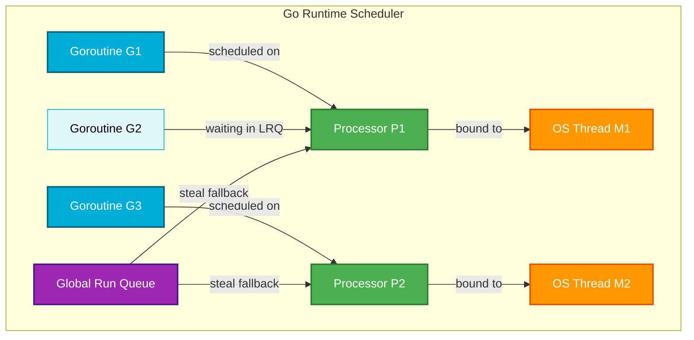
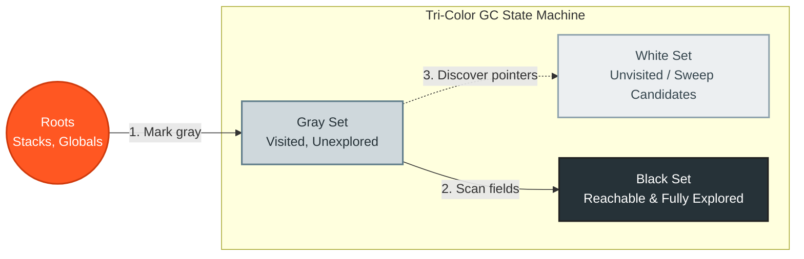
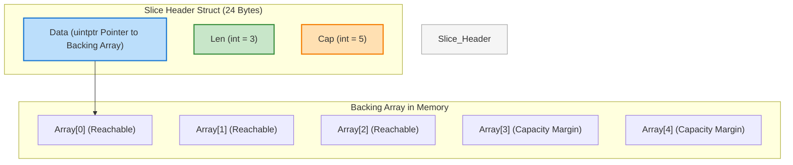

# 🚀 The Ultimate Go (Golang) Interview Cheat Sheet

[](https://go.dev/)
[](https://github.com/Protocol-Lattice/golang-interview-prep-in-english)
[](https://github.com/Protocol-Lattice/golang-interview-prep-in-english)

Welcome to the **Ultimate Go Interview Preparation Guide & Cheat Sheet**. This reference has been meticulously designed and engineered to serve as a high-density, easily skimmable, and visually rich reference during live technical screens, system design rounds, or rapid pre-interview revision. 

It preserves deep technical accuracy while presenting complex topics in a "scan-and-speak" layout.

---

## 💡 Live Technical Interview Tactics

> [!IMPORTANT]
> When hit with a tough Go question, follow this three-step blueprint:
> 1. **Deliver the 5-Second Answer:** State the core mechanism instantly using exact technical keywords (e.g., *"A Go channel is a pointer to an `hchan` struct protected by a mutex..."*). This proves immediate confidence.
> 2. **Draw the Architecture:** Reference scheduler entities ($G, M, P$), memory layouts, or tri-color stages.
> 3. **Reveal the Runtime "Why":** Explain the design trade-off (e.g., *"Go chose an M:N user-space scheduler to avoid expensive OS kernel context-switches..."*).

---

## 📋 Table of Contents

- [⚡ One: Core Concurrency & Runtime (The Engine)](#-one-core-concurrency--runtime-the-engine)
- [🧹 Two: Memory Management & GC Internals](#-two-memory-management--gc-internals)
- [🧩 Three: Go Language Deep-Dives](#-three-go-language-deep-dives)
- [🌐 Four: Networking & APIs (HTTP vs gRPC)](#-four-networking--apis-http-vs-grpc)
- [🏗️ Five: System Design & Infrastructure](#-five-system-design--infrastructure)
- [🔥 Six: The Master Cheat Sheets](#-six-the-master-cheat-sheets)
- [💻 Seven: Production-Ready Code Exercises](#-seven-production-ready-code-exercises)
- [📚 Eight: High-Quality Curated Resources](#-eight-high-quality-curated-resources)

---

## ⚡ One: Core Concurrency & Runtime (The Engine)

### 🚀 Runtime Concurrency Speed Sheet (Read in 10s)
* **Concurrency vs. Parallelism:** Concurrency is about **structure** (handling multiple tasks at once). Parallelism is about **execution** (simultaneous work on multiple CPU cores).
* **M:N Scheduler:** Maps $M$ Goroutines ($G$) onto $N$ OS Threads ($M$) using $P$ Logical Contexts.
* **Work Stealing:** Idle $P$ steals **half** of another $P$'s Local Run Queue (LRQ), checks the Global Run Queue (GRQ) every 61 ticks, or checks network pollers.
* **Syscall Handoff:** Network I/O detaches $G$ to the **Network Poller** (non-blocking). Blocking syscalls detach the OS Thread ($M$) from its Processor ($P$), allowing $P$ to run other $G$'s on a different $M$.
* **Preemption:** Asynchronous since Go 1.14 using Unix OS signals (`SIGURG`) sent every 10ms to interrupt tight, function-less loops.
* **Goroutine vs Thread:** Goroutine starts with a **2 KB** dynamic stack (vs. 1-8 MB fixed thread stack), executes in user-space, and has a sub-100ns context-switch time.
* **Channels:** Managed by the `hchan` struct. Contains a circular queue buffer, a lock, and waiting sender/receiver linked lists.

---

### The Go M:N Scheduler Architecture

Go uses an **M:N user-space scheduler** to multiplex Goroutines across physical kernel threads without OS overhead.



#### The Core Entities (G, M, P)
* **G (Goroutine):** User-space green thread. Holds execution stack (starts at **2 KB**, grows dynamically up to 1 GB), program counter, and scheduling metadata.
* **M (OS Thread / Machine):** A real OS thread managed by the host OS kernel scheduler.
* **P (Processor / Logical Context):** Represents resources required to execute Go code. The number of Ps is governed by `$GOMAXPROCS` (defaults to CPU cores). Each P maintains a **Local Run Queue (LRQ)** of up to 256 runnable Goroutines.

#### Scheduling Algorithms & Core Mechanics
1. **Work Stealing:** When a P finishes its LRQ:
   * It checks the **Global Run Queue (GRQ)** (polled 1 out of every 61 scheduler ticks to prevent starvation).
   * It attempts to steal **half** of another P's local run queue.
   * If still empty, it checks network pollers.
2. **Syscall Handoff (Network Poller vs. Syscall):**
   * **Blocking Syscall:** When G blocks on a file I/O syscall, the scheduler detaches the running OS thread (M) from its P. The P continues executing other Gs by acquiring or creating a new OS thread (M).
   * **Network I/O:** Handled out-of-band by the Network Poller (using OS abstractions like `epoll` or `kqueue`). The G registers its interest, detaches from P, and goes to sleep, freeing the P and M to run other Gs immediately.
3. **Preemption:**
   * **Cooperative (Pre-Go 1.14):** Goroutines could only be preempted at function call boundaries where compiler-injected stack checks (`morestack`) occurred. A tight loop `for {}` without function calls could freeze a thread.
   * **Asynchronous (Go 1.14+):** Uses OS signals (`SIGURG` on Unix systems) to interrupt and preempt running goroutines every 10ms, preventing long-running goroutines from hogging CPUs.

---

### Goroutines vs. OS Threads

| Feature | Goroutine (Go Green Thread) | OS Thread (Kernel Thread) |
| :--- | :--- | :--- |
| **Memory Footprint** | Dynamic stack starts at **2 KB** (grows/shrinks up to 1GB). | Fixed stack size set by OS (typically **1 MB to 8 MB**). |
| **Creation Cost** | Extremely low (~nanoseconds). Allocated purely in user-space heap. | High (~microseconds). Demands a system call to the OS kernel. |
| **Context Switch Cost**| Very fast (~10ns - 100ns). Saves ~14 registers. | Slow (~1µs - 2µs). Causes CPU cache line misses, TLB flushes. |
| **Scheduling Model** | User-space M:N scheduler (cooperative & async signal). | Kernel-space 1:1 scheduler (preemptive). |

---

### Channels & the `hchan` Struct

Under the hood, a Go channel is not a magical pipe; it is a pointer to an `hchan` struct (defined in `runtime/chan.go`):

```go
type hchan struct {
    qcount   uint           // Total data in the circular queue
    dataqsiz uint           // Capacity of the circular queue (buffer size)
    buf      unsafe.Pointer // Pointer to an underlying circular array
    elemsize uint16
    closed   uint32         // 1 if closed, 0 otherwise
    elemtype *_type         // Element type
    sendx    uint           // Send index in the circular buffer
    recvx    uint           // Receive index in the circular buffer
    recvq    waitq          // Linked list of blocked receivers (waitq of sudog)
    sendq    waitq          // Linked list of blocked senders (waitq of sudog)
    lock     mutex          // Protects all fields in hchan
}
```

#### Channel State & Operations Matrix

> [!WARNING]
> This table is the single most tested aspect of Go concurrency in coding screens!

| Channel State | Send (`ch <- x`) | Receive (`<-ch`) | Close (`close(ch)`) |
| :--- | :--- | :--- | :--- |
| **Nil** (`var ch chan T`) | **Blocks forever** | **Blocks forever** | **Panics** (`panic: close of nil channel`) |
| **Open & Empty** | Succeeds (blocks if unbuffered) | **Blocks** | Succeeds (receivers get zero-value, `ok == false`) |
| **Open & Full** | **Blocks** | Succeeds | Succeeds (receivers get zero-value, `ok == false`) |
| **Closed** | **Panics** (`panic: send on closed channel`) | Succeeds immediately (returns zero-value, `ok == false`) | **Panics** (`panic: close of closed channel`) |

---

### Synchronization Primitives
* **`sync.Mutex` Starvation Mode:**
  * **Normal Mode:** Waiters are kept in a LIFO/FIFO queue, but newly active CPU goroutines also compete for the lock. New goroutines usually win because they are already on the CPU.
  * **Starvation Mode:** If a waiter fails to acquire the Mutex for > **1ms**, the Mutex enters starvation mode. The lock is transferred **directly** to the front waiter. New arrivals do not spin or attempt to steal the lock; they immediately enqueue. This mitigates tail-latency spikes.
* **`sync.RWMutex`:** A reader-writer lock. Multiple readers can hold the read lock (`RLock`), but the write lock (`Lock`) is completely exclusive. To prevent writer starvation, new readers are blocked if a writer is already waiting.
* **`sync.WaitGroup`:** Atomic uint64 counter. Two 32-bit halves (on 32-bit platforms) or a uint64 representing the wait count and the waiter count. Manipulated atomically.
* **`sync.Map`:** Specialized concurrent map optimized for two cases:
  1. Read-heavy workloads where keys don't change frequently.
  2. Disjoint concurrent writes (different keys written by different goroutines).
  * *How it works:* Uses two maps: a lockless `read` map (updated atomically) and a locked `dirty` map. Lookups check `read` first. If it misses repeatedly (above a threshold), the `dirty` map is promoted to the `read` map under a lock.

---

## 🧹 Two: Memory Management & GC Internals

### 🚀 Garbage Collection & Memory Speed Sheet (Read in 10s)
* **Tri-Color GC:** Concurrent, low-latency mark-and-sweep. Divides pointers into **White** (unreachable candidates), **Gray** (visited, children unscanned), and **Black** (visited and fully scanned).
* **Write Barrier:** Intercepts runtime pointers to enforce the GC invariant: ensures a running application doesn't hide a white object behind a black one.
* **Stack vs. Heap:** Stack is LIFO, managed by threads, zero-GC overhead. Heap is globally shared, TCMalloc-designed, managed by the GC.
* **Escape Analysis:** Compile-time analysis to decide if memory goes to the stack or escapes to the heap.
* **Heap Escape Triggers:** Returning local pointers, interface values (dynamic dispatch like `fmt.Println`), dynamic/large size slice allocations, and sending pointers over channels.

---

### The Tri-Color Mark & Sweep GC

Go uses a concurrent, tri-color mark-and-sweep garbage collector designed for low latency.



1. **White Set (Unvisited):** Candidates for deletion. At the start of a GC cycle, all objects are White.
2. **Gray Set (Visited, Unexplored):** Reachable from roots, but their children have not been scanned yet.
3. **Black Set (Visited & Explored):** Reachable, and all child pointers have been fully scanned. Black objects contain no pointers directly to White objects.

#### The GC Process:
* **Phase 1: Sweep Termination (STW - Stop The World):** Prepares for marking, activates write barriers.
* **Phase 2: Concurrent Mark:** Scans root pointers (stacks, globals) and pushes them onto the gray queue. Goroutines traverse gray objects, mark children gray, and mark parents black.
* **Phase 3: Mark Termination (STW):** Flushes local cache buffers, completes the marking phase.
* **Phase 4: Concurrent Sweep:** Reclaims memory occupied by remaining White objects and returns it to the allocator.

#### Why do we need the Write Barrier?
Since GC runs concurrently with application threads (mutators), a mutator could hide a white object by assigning it to a black object and breaking the pointer chain from gray objects. The **Write Barrier** intercepts write operations at runtime: if a pointer to a white object is written, it is forced into the gray set, preserving the GC invariants.

---

### Stack vs. Heap & Escape Analysis
* **Stack:** Very fast, local allocation. Follows LIFO structure, managed at thread-level, does not require garbage collection.
* **Heap:** Shared memory pool. Slower allocation, managed via a TCMalloc-inspired allocator (`mcache` -> `mcentral` -> `mheap`), reclaimed by the Garbage Collector.

#### Escape Analysis Rules
The Go compiler uses Escape Analysis at compile-time to decide if a variable can reside on the stack or must escape to the heap.

> [!IMPORTANT]
> **Common Causes of Heap Escape:**
> 1. **Returning a Pointer:** A pointer to a local variable is returned from a function. The variable's lifetime exceeds the function's stack frame.
> 2. **Interface Dynamic Dispatch:** Storing a concrete type in an interface (e.g., calling `fmt.Println(x)` or `json.Marshal(x)`).
> 3. **Dynamic / Large Allocations:** Creating a slice with a size only known at runtime (e.g., `make([]byte, size)`) or exceeding the compiler's size threshold (~64KB).
> 4. **Channel Transmission:** Sending a pointer to a channel (the compiler cannot guarantee which goroutine receives it or when).

#### How to Analyze Escape Decisions:
```bash
go build -gcflags="-m -l" main.go
```
*Note: The `-l` flag disables function inlining, making escape analysis decisions easier to trace.*

---

## 🧩 Three: Go Language Deep-Dives

### 🚀 Language Semantics Speed Sheet (Read in 10s)
* **Slices:** 24-byte header referencing a backing array. Contains `Data` pointer, `Len`, and `Cap`.
* **Slice Growth:** Doubles if $< 256$ elements. For larger sizes, grows by a scaling factor transitioning smoothly toward $1.25\times$.
* **Maps:** Pointer to an `hmap` struct holding a collection of 8-item buckets (`bmap`). Concurrent read/write throws a non-recoverable runtime panic.
* **Interface Nil Trap:** Interfaces hold `type` and `data` fields. An interface is only `nil` if **both** fields are `nil`.
* **Defer:** Executed LIFO at function exit. Arguments are evaluated **immediately** when the `defer` line is encountered, not when executing.

---

### Slices Under the Hood

A slice is not an array; it is a **descriptor header** containing metadata that references a backing array. It is defined in `reflect.SliceHeader`:



```go
type SliceHeader struct {
    Data uintptr // Pointer to the underlying array element
    Len  int     // Length: number of elements in the slice
    Cap  int     // Capacity: maximum elements the backing array can hold
}
```

* **Pass-By-Value:** Go passes everything by value. Passing a slice into a function copies the 24-byte `SliceHeader`. Modifying elements inside the function alters the shared backing array, but appending to the slice within the function may reallocate a new backing array, leaving the caller's slice header unchanged.

#### Slice Capacity Growth (Go 1.18+):
1. If the new capacity is greater than double the old capacity, the new capacity is set to the requested capacity.
2. Otherwise, if the old capacity is less than 256, it doubles.
3. For larger capacities, it transitions to a scale factor:
   $$\text{newcap} = \text{oldcap} + \frac{\text{oldcap} + 3 \times 256}{4}$$
   *This ensures a smooth transition from $2\times$ growth to $1.25\times$ growth.*

---

### Maps Under the Hood
A Go map is a pointer to an `hmap` struct. Maps are implemented as a collection of buckets:
* **Structure:** Each bucket (`bmap` struct) holds up to 8 key-value pairs.
* **Accessing a Key:** Go hashes the key. The low-order bits determine which bucket contains the key, and the high-order bits (`tophash`) identify the specific key within the bucket.
* **Why maps are NOT thread-safe:** Maps are optimized for speed. Reading/writing maps concurrently sets a `flags` bit in `hmap`. If the runtime detects a write while another operation is in progress, it triggers a non-recoverable runtime crash: `fatal error: concurrent map writes`.
* **How to make them safe:** Wrap the map in a struct with a `sync.RWMutex`, or use `sync.Map`.

---

### The Interface Nil Trap
This is one of the most common senior-level Go trick questions.

```go
var p *int = nil
var i any = p

fmt.Println(i == nil) // Outputs: FALSE!
```

#### Why?
An interface variable contains two fields internally:
1. `type` (dynamic type information, e.g., `*int`).
2. `data` (pointer to the concrete value, e.g., `nil`).

An interface value is only considered `nil` if **both** the `type` and `data` fields are `nil`. In the example above, `i` has a valid type pointer (`*int`), so `i == nil` evaluates to `false`.

---

## 🌐 Four: Networking & APIs (HTTP vs gRPC)

### 🚀 Networking & API Speed Sheet (Read in 10s)
* **Idempotency:** `GET`, `PUT`, `DELETE` are idempotent (repeated calls yield identical server states). `POST`, `PATCH` are non-idempotent.
* **HTTP/2 Benefits:** Fully binary transport, multiplexes multiple streams over one TCP connection, uses HPACK header compression, and supports Server Push.
* **gRPC core:** Operates over HTTP/2, uses binary Protobuf serialization, and facilitates four streaming modes: Unary, Client-Streaming, Server-Streaming, and Bidirectional-Streaming.

---

### HTTP Methods & Idempotency

| Method | Safe | Idempotent | Request Body | Response Body |
| :--- | :---: | :---: | :---: | :---: |
| **GET** | ✅ Yes | ✅ Yes | ❌ No | ✅ Yes |
| **POST** | ❌ No | ❌ No | ✅ Yes | ✅ Yes |
| **PUT** | ❌ No | ✅ Yes | ✅ Yes | ✅ Yes/No |
| **PATCH**| ❌ No | ❌ No | ✅ Yes | ✅ Yes |
| **DELETE**| ❌ No | ✅ Yes | ❌ No | ✅ Yes/No |

* **Safe:** Does not modify resource state on the server.
* **Idempotent:** Making multiple identical requests yields the same server state as a single request.

---

### HTTP/1.1 vs. HTTP/2

| Feature | HTTP/1.1 | HTTP/2 |
| :--- | :--- | :--- |
| **Transport Format** | Plain Text | Binary Framing (Stream/Frame structure) |
| **Multiplexing** | ❌ No (Requires multiple TCP connections) | ✅ Yes (Concurrent streams over a single TCP connection) |
| **Header Compression**| ❌ No (Text headers sent repeatedly) | ✅ Yes (HPACK compression) |
| **Server Push** | ❌ No | ✅ Yes (Server can preemptively push resources) |

---

## 🏗️ Five: System Design & Infrastructure

### 🚀 Architecture Speed Sheet (Read in 10s)
* **Autoscaling:** HPA scales **pod counts** horizontally (via CPU/metrics). VPA scales **pod resources** vertically (CPU/memory limits). Do not run both on the same metric!
* **Rate Limiting:** Token Bucket (allows bursts up to capacity), Leaky Bucket (smooths output to a constant rate), Sliding Window (strict time window accuracy).
* **Resiliency:** Circuit Breakers fail-fast immediately on open states to protect downstream systems. Backoffs use dynamic exponential intervals with random **jitter** to prevent thundering herd spikes.

---

### Autoscaling: HPA vs. VPA
* **Horizontal Pod Autoscaler (HPA):** Scales the **number of pods** in response to metrics like CPU usage, Memory limits, or custom Prometheus metrics (e.g., HTTP request rate).
* **Vertical Pod Autoscaler (VPA):** Adjusts the **CPU and Memory limits** of existing pods. Useful for stateful services.
* *Production Warning:* Do not run HPA and VPA concurrently on the exact same resource metrics (like CPU/Memory) to avoid race conditions.

---

### Rate Limiting Algorithms
1. **Token Bucket:** A bucket is filled with tokens at a constant rate up to a max capacity. Every request consumes a token. Allows handling bursts up to the bucket capacity.
2. **Leaky Bucket:** Requests enter a queue and are processed at a constant, fixed rate. Smoothes out traffic spikes but adds latency to bursts.
3. **Sliding Window Counter:** Divides time into windows and keeps track of requests. Prevents sudden traffic bursts at window boundaries.

---

### Microservice Resiliency
* **Circuit Breaker:** Prevents cascading failures.
  * **Closed:** Normal traffic flows.
  * **Open:** Fails fast immediately without calling the struggling downstream service.
  * **Half-Open:** Periodically sends a small fraction of traffic to test if the downstream service has recovered.
* **Exponential Backoff and Jitter:** When retrying failed requests, double the wait time with each retry (exponential) and add a random variance (jitter) to prevent the "thundering herd" problem from overwhelming downstream databases.

---

## 🔥 Six: The Master Cheat Sheets

This section is engineered to be your primary companion during a live interview. The middle column offers immediate, high-yield answers you can deliver within the first 5 seconds.

### 🐣 Junior & Mid-Level Cheat Sheet

| 🎯 The Trick Question | ⚡ 5-Second Answer (Immediate Impact) | 🔍 Detailed Technical Deep-Dive |
| :--- | :--- | :--- |
| **When should you use a pointer receiver?** | Use them **to modify receiver state** or **to avoid copying massive structs** on method execution. | 1. If the method mutates the struct's internal fields.<br>2. When passing a large struct by value degrades memory and CPU performance due to deep copy allocations.<br>3. When maintaining consistent method sets across interfaces. |
| **What happens if you write to a nil map?** | It triggers an **immediate, unrecoverable runtime panic**. | A nil map pointer does not reference an initialized `hmap` struct. To avoid `panic: assignment to entry in nil map`, you must allocate bucket memory first via `make(map[K]V)`. |
| **How do you avoid goroutine leaks?** | Ensure **every goroutine has a guaranteed exit condition** using contexts or closed channels. | 1. Never launch a goroutine without knowing how and when it terminates.<br>2. Pass a cancelable `context.Context` to abort waiting workers.<br>3. Avoid blocking sends on unbuffered channels where no receiver is active. |
| **Why does Go use `make` vs. `new`?** | `new` allocates **zeroed memory** returning `*T`; `make` **initializes internal headers** for slices, maps, and channels. | - `new(T)` returns a pointer (`*T`) to a zero-filled type `T` (works on all types).<br>- `make(T, args)` is restricted exclusively to slices, maps, and channels; it sets up complex internal runtime headers (like backing arrays, `hmap` bucket pointers, or `hchan` circular buffers). |
| **How does Go 1.22 fix the loop variable bug?** | Loop variables are now **freshly allocated per iteration**, resolving closures capturing the same address. | Prior to 1.22, a loop variable shared a single memory address across all iterations. Goroutines launched inside the loop captured that same pointer, leading to race conditions. Since 1.22, the compiler generates a new scope and allocation per iteration. |
| **How do you safely detect race conditions?** | Execute your test suite or runtime binary with the **`-race` compiler flag**. | Enabling the race detector (`go test -race` or `go run -race`) injects thread instrumentation that tracks memory access boundaries. It raises warnings if two concurrent goroutines access the same memory location, where at least one access is a write, without synchronization. |

---

### 🦅 Senior & Staff-Level Cheat Sheet

| 🎯 The Trick Question | ⚡ 5-Second Answer (Immediate Impact) | 🔍 Detailed Technical Deep-Dive |
| :--- | :--- | :--- |
| **How do you tune Go's GC?** | Optimize memory cycles using **`GOGC`** for target heap ratios and **`GOMEMLIMIT`** to prevent OOMs. | 1. **`GOGC` (default 100):** Governs target heap growth ratio. A value of 100 means GC runs when live heap size doubles.<br>2. **`GOMEMLIMIT` (Go 1.19+):** Defines a hard memory limit. Prevents OOM kills in containerized environments by triggering aggressive GC sweeps as memory usage approaches the limit. |
| **Explain Mutex Starvation mode.** | It prevents waiter starvation by **transferring the lock directly** to the first queue waiter if wait time exceeds 1ms. | - **Normal Mode:** Waiters queue, but newly spawned active goroutines on the CPU often steal the lock because they are already scheduled.<br>- **Starvation Mode:** Triggered if a waiter has waited $>1\text{ms}$. New CPU arrivals do not spin or attempt to acquire the lock; they enqueue directly. The current owner hands the lock directly to the front-of-queue waiter, mitigating tail-latency spikes. |
| **How do you profile a Go service in production?** | Integrate **`net/http/pprof`** to extract and analyze low-overhead flamegraphs. | Pull interactive, low-overhead performance charts directly using `go tool pprof`. You can collect CPU, memory, thread creation, and blocking profiles with negligible impact on live requests, helping to identify lock contention or excessive allocations. |
| **What is Profile-Guided Optimization (PGO)?** | PGO lets the compiler **optimize code generation** using real performance profiles collected from production. | Introduced in Go 1.20, PGO allows the compiler to optimize code generation (e.g., devirtualizing interface calls, aggressive function inlining) using real performance profiles collected from production, boosting CPU efficiency by 2% to 14%. |
| **What are contiguous stacks in Go?** | Go uses **dynamic contiguous stacks** that automatically double in size and copy values when exhausted. | If a goroutine requires more stack space than its current frame provides, Go allocates a new, double-sized contiguous memory block, copies the old stack, updates all pointers, and frees the old block. |
| **Why are maps not concurrent safe?** | To **maximize raw speed**; Go chooses immediate crashes over silent data corruption on concurrent writes. | To maximize execution speed. Concurrent map writes set a flag; if Go detects simultaneous read/write or write/write operations, it calls `throw()` to trigger an immediate, non-recoverable runtime crash. |

---

## 💻 Seven: Production-Ready Code Exercises

These templates demonstrate clean coding styles, precise concurrency control, and standard idioms expected in senior interviews.

### Exercise 1: Generic Thread-Safe Cache with TTL

This is a standard senior-level interview task requiring generics, concurrent read-write synchronization, and a background janitor to prune expired entries.

<details>
<summary><b>🛠️ Click to view Cache Implementation</b></summary>

```go
package cache

import (
	"sync"
	"time"
)

// Option configures the Cache at construction time.
type Option func(*cacheConfig)

type cacheConfig struct {
	defaultTTL   time.Duration // 0 means no default expiration
	cleanupEvery time.Duration // 0 means background cleanup is disabled
}

// WithDefaultTTL configures the default lifetime of items in the cache.
func WithDefaultTTL(ttl time.Duration) Option {
	return func(c *cacheConfig) { c.defaultTTL = ttl }
}

// WithCleanupInterval configures how often the background cleanup janitor runs.
func WithCleanupInterval(every time.Duration) Option {
	return func(c *cacheConfig) { c.cleanupEvery = every }
}

type entry[V any] struct {
	value    V
	expireAt time.Time // Zero value means no expiration
}

// Cache is a high-performance, concurrent-safe in-memory key-value store.
type Cache[K comparable, V any] struct {
	mu           sync.RWMutex
	items        map[K]entry[V]
	defaultTTL   time.Duration
	cleanupEvery time.Duration
	stopCh       chan struct{}
	doneCh       chan struct{}
}

// New creates a new, optimized Cache instance.
func New[K comparable, V any](opts ...Option) *Cache[K, V] {
	cfg := cacheConfig{}
	for _, o := range opts {
		o(&cfg)
	}
	
	c := &Cache[K, V]{
		items:        make(map[K]entry[V]),
		defaultTTL:   cfg.defaultTTL,
		cleanupEvery: cfg.cleanupEvery,
	}
	
	if c.cleanupEvery > 0 {
		c.startJanitor()
	}
	return c
}

// Close stops the background janitor cleanly, blocking until it exits.
func (c *Cache[K, V]) Close() {
	if c.stopCh == nil {
		return
	}
	close(c.stopCh)
	<-c.doneCh
}

// Set inserts or updates a key-value pair using the default TTL.
func (c *Cache[K, V]) Set(key K, value V) {
	c.SetWithTTL(key, value, c.defaultTTL)
}

// SetWithTTL inserts or updates a key-value pair with a specific custom TTL.
func (c *Cache[K, V]) SetWithTTL(key K, value V, ttl time.Duration) {
	var exp time.Time
	if ttl > 0 {
		exp = time.Now().Add(ttl)
	}

	c.mu.Lock()
	c.items[key] = entry[V]{value: value, expireAt: exp}
	c.mu.Unlock()
}

// Get retrieves a value by key. Handles lazy deletion on cache misses.
func (c *Cache[K, V]) Get(key K) (V, bool) {
	c.mu.RLock()
	e, ok := c.items[key]
	if !ok {
		c.mu.RUnlock()
		var zero V
		return zero, false
	}
	expired := !e.expireAt.IsZero() && time.Now().After(e.expireAt)
	value := e.value
	c.mu.RUnlock()

	if !expired {
		return value, true
	}

	// Double-check expiration under a write lock to perform lazy deletion safely
	c.mu.Lock()
	if e2, ok2 := c.items[key]; ok2 && !e2.expireAt.IsZero() && time.Now().After(e2.expireAt) {
		delete(c.items, key)
	}
	c.mu.Unlock()

	var zero V
	return zero, false
}

// Pop removes and returns an item from the cache.
func (c *Cache[K, V]) Pop(key K) (V, bool) {
	c.mu.Lock()
	defer c.mu.Unlock()

	e, ok := c.items[key]
	if !ok {
		var zero V
		return zero, false
	}

	if !e.expireAt.IsZero() && time.Now().After(e.expireAt) {
		delete(c.items, key)
		var zero V
		return zero, false
	}

	delete(c.items, key)
	return e.value, true
}

func (c *Cache[K, V]) startJanitor() {
	c.stopCh = make(chan struct{})
	c.doneCh = make(chan struct{})

	go func() {
		defer close(c.doneCh)
		ticker := time.NewTicker(c.cleanupEvery)
		defer ticker.Stop()

		for {
			select {
			case <-ticker.C:
				c.removeExpired()
			case <-c.stopCh:
				return
			}
		}
	}()
}

func (c *Cache[K, V]) removeExpired() {
	now := time.Now()
	c.mu.Lock()
	for k, e := range c.items {
		if !e.expireAt.IsZero() && now.After(e.expireAt) {
			delete(c.items, k)
		}
	}
	c.mu.Unlock()
}
```
</details>

---

### Exercise 2: Graceful Worker Pool with Context Cancellation

This design demonstrates standard channel orchestration, clean synchronization, and immediate shutdown on parent contexts aborting.

<details>
<summary><b>🛠️ Click to view Worker Pool Implementation</b></summary>

```go
package pool

import (
	"context"
	"fmt"
	"sync"
	"time"
)

// Task represents a unit of concurrent work.
type Task struct {
	ID   int
	Data string
}

// Result represents the outcome of a processed Task.
type Result struct {
	TaskID int
	Output string
	Err    error
}

// WorkerPool manages the concurrent processing of tasks.
type WorkerPool struct {
	numWorkers  int
	tasksChan   chan Task
	resultsChan chan Result
	wg          sync.WaitGroup
}

// NewWorkerPool initializes a new WorkerPool.
func NewWorkerPool(numWorkers int) *WorkerPool {
	return &WorkerPool{
		numWorkers:  numWorkers,
		tasksChan:   make(chan Task),
		resultsChan: make(chan Result),
	}
}

// Start spawns the workers and prepares them to listen for tasks.
func (wp *WorkerPool) Start(ctx context.Context) {
	for i := 1; i <= wp.numWorkers; i++ {
		wp.wg.Add(1)
		go wp.worker(ctx, i)
	}
}

func (wp *WorkerPool) worker(ctx context.Context, workerID int) {
	defer wp.wg.Done()
	
	for {
		select {
		case <-ctx.Done():
			// Exit worker immediately on context cancellation
			return
		case task, ok := <-wp.tasksChan:
			if !ok {
				// Tasks channel closed, exit gracefully
				return
			}

			output, err := wp.process(ctx, task)
			
			select {
			case <-ctx.Done():
				return
			case wp.resultsChan <- Result{TaskID: task.ID, Output: output, Err: err}:
			}
		}
	}
}

func (wp *WorkerPool) process(ctx context.Context, t Task) (string, error) {
	// Simulate work or network request
	select {
	case <-time.After(50 * time.Millisecond):
	case <-ctx.Done():
		return "", ctx.Err()
	}

	if t.ID%5 == 0 {
		return "", fmt.Errorf("simulated error for task %d", t.ID)
	}
	return fmt.Sprintf("Success processing data: %s", t.Data), nil
}

// Submit sends a task into the queue.
func (wp *WorkerPool) Submit(task Task) {
	wp.tasksChan <- task
}

// Results returns a read-only channel for collecting outputs.
func (wp *WorkerPool) Results() <-chan Result {
	return wp.resultsChan
}

// Stop cleanly terminates all workers and closes open channels.
func (wp *WorkerPool) Stop() {
	close(wp.tasksChan)
	wp.wg.Wait()
	close(wp.resultsChan)
}
```
</details>

---

## 📚 Eight: High-Quality Curated Resources

* **Official Documentation:**
  * [Effective Go](https://golang.org/doc/effective_go) — The definitive style guide.
  * [Go Memory Model](https://golang.org/ref/mem) — In-depth details on execution ordering and synchronization invariants.
* **Deep-Dive Reading:**
  * [Go 101](https://go101.org/) — Structural mechanics, semantic rules, and internals.
  * [High Performance Go (Dave Cheney)](https://dave.cheney.net/) — Crucial guidelines for profiling, heap layout, and optimization.
* **Tools & Profiling:**
  * `go tool pprof` — Native CPU and memory profiling system.
  * `go tool trace` — Advanced tracer for viewing execution bottlenecks.

---
*Maintained with ❤️ for the Go engineering community.*
